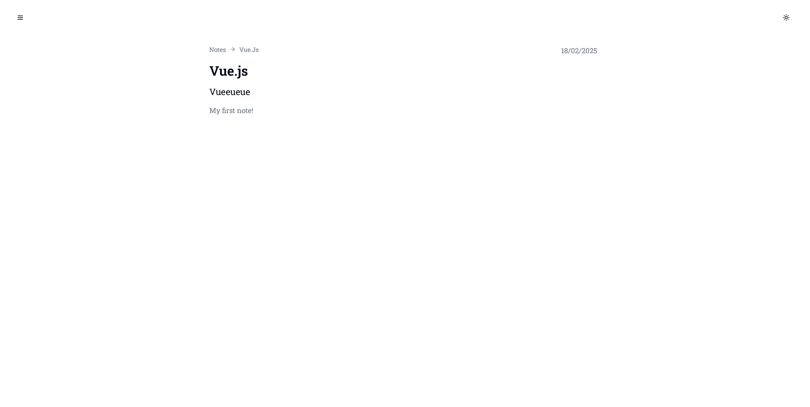
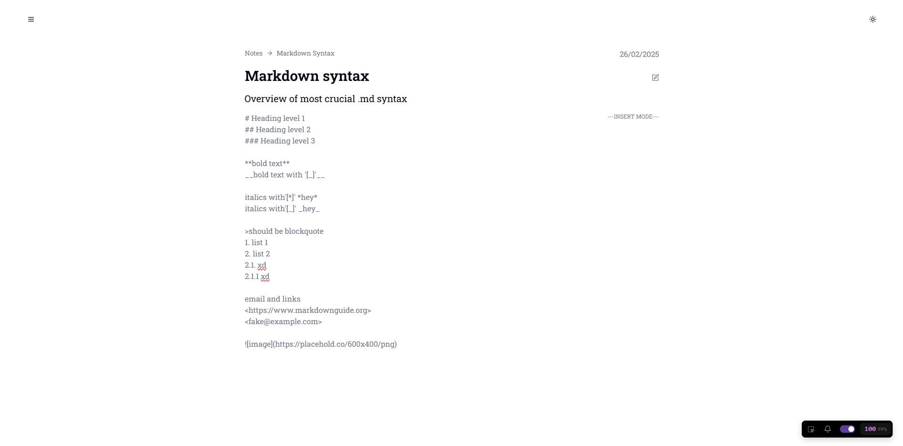
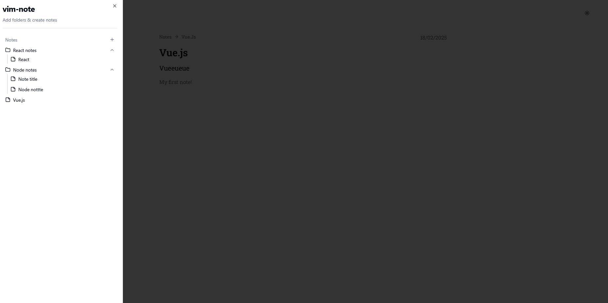

# vim-note

In memory browser note taking app

## Why?

To learn how to integrate AI into markdown files.
It also uses a turborepo for some reason

## Features

- Tree like folder/note structure (x)
- Adding md content into note (x)
- Add local images (x) / tldraw
- Generating md content via ai (x)
- Vim motions in text editor

## Images

