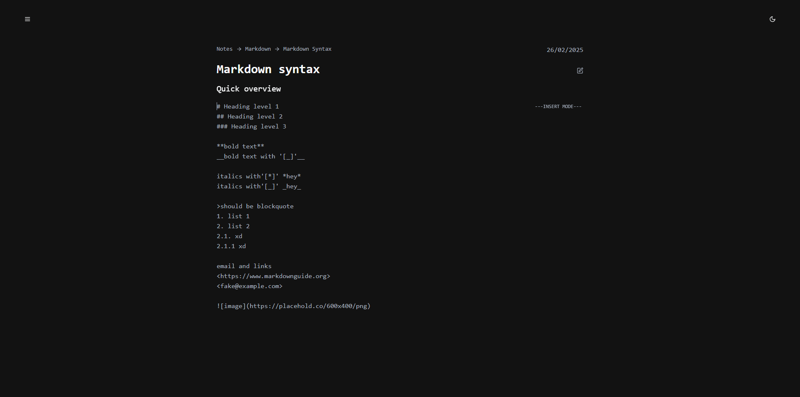

# vim-note

In memory browser note taking app

## Why?

To learn more about markdowns

## Demo

Newest release can be found [Here](https://vim-note-production.up.railway.app)

## Installation

```bash
pnpm install # Install dependencies
```

```bash
pnpm dev # Run locally
```

```bash
pnpm test:web # Run tests
```

## Features

- Tree like folder/note structure (x)
- Adding md content into note (x)
- Add local images (x) / tldraw
- Generating md content via ai (x)
- Vim motions in text editor

## Images




